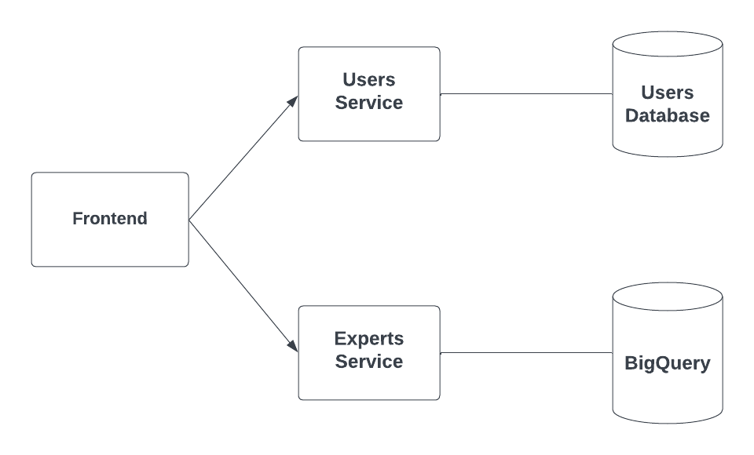

# Auguretis

Find the most experienced experts in any areas through stackoverflow.

# Design

Powered by a microservices architecture. 

The services communicate with each other via using RabbitMQ and queries are cached with Redis to reduce latency.

# To-Do
- Add Semantic Search Demo
